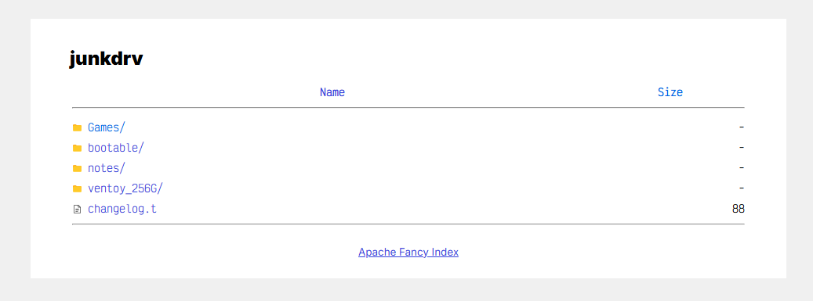

# Apache2 Fancy Index

So this is a project I started, attempting to make my home servers' Apache2 Index pages look better. Unhappy with the directory index pages that such as [Free PHP File Directory Script](//github.com/halgatewood/file-directory-list/) *(which is a perfectly good script!)* - I just wanted something different. 

You will need to run your own server, physical or virtual, doesn't matter, but you will need to know HTML CSS3 & some PHP, along with a good grasp of Linux, with Apache2 configuration.

## Setup

- Place the header & footer php files in the the root directory of the assigned www vhost.
- Rename htaccess to .htaccess OR copy it's contents into *(after some editing)* to /etc/apache2/site-enabled/website.conf

  
### Example

